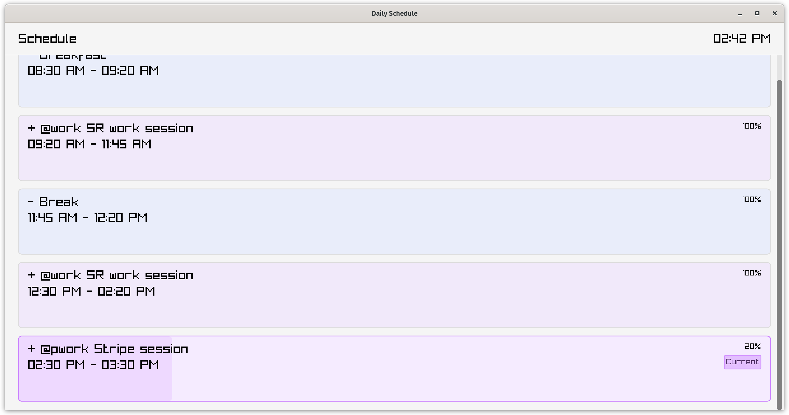

# Scheduler

A small tool that displays a day schedule blocked by slots of time. Built using [raylib](https://www.raylib.com/) and C.



## Building

```sh
cd deps
./DEPS
cd ..
make install-deps && make && make install
```

## Running

```sh
schdl
```

You'll need to have a directory with `.schedule` files inside. With the following format:

```
Meeting with John: 09:00 - 10:00.
Work on project X: 10:00 - 13:00.
Break: 1:00pm - 02:30 pm.
```
All these lines are valid but must end with `.`, you can use time formats in 12 or 24 hours. An example schedule for tuesday is provided.
Schedule files are loaded according to the week day, so they need to be named like `sunday.schedule`, `monday.schedule`, etc.

## License

This project is licensed under the MIT License. See the [LICENSE](LICENSE) file for details.
